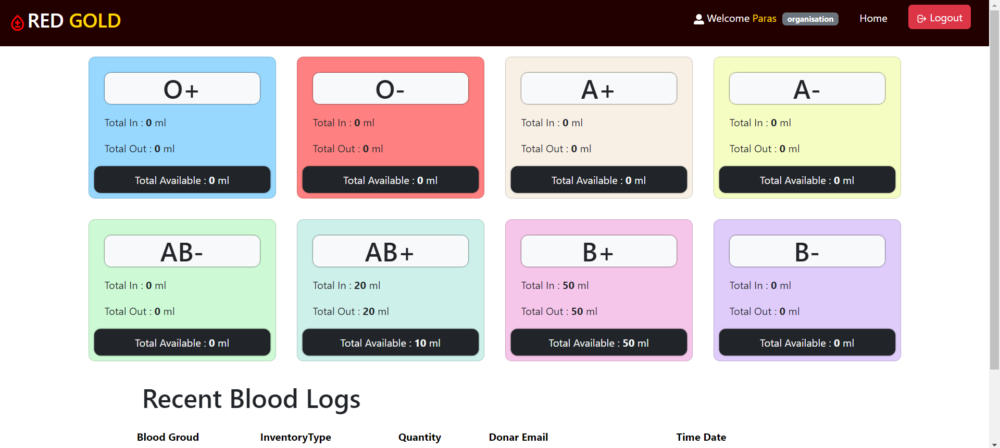
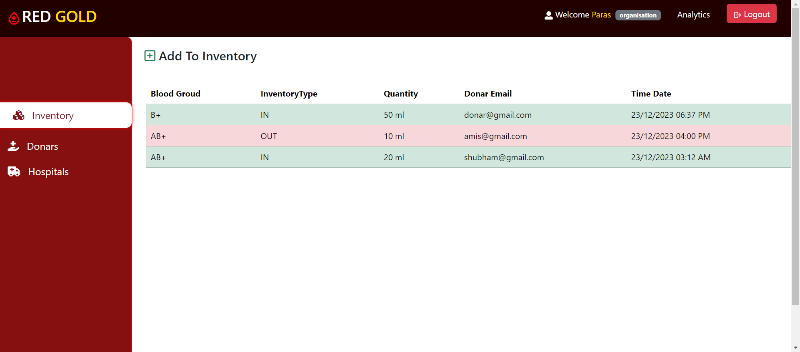

# Blood Bank Using MERN

Blood Bank is a web application developed using the MERN (MongoDB, Express.js, React, Node.js) stack. It allows users to manage blood donation activities, catering to different roles such as admin, donor, hospital, and organization.

## Features

- **User Roles:**
  - Admin: Manages overall system settings, user roles, and data.
  - Donor: Registers as a blood donor, view personal info and donation logs, and donate blood throught Organization.
  - Hospital: Manages blood inventory, requests blood from Organization, Tracks consumers.
  - Organization: Coordinates blood donation drives, manages events, and tracks donation statistics.

- **Authentication:**
  - JWT (JSON Web Tokens) are used for secure authentication.
  - Passwords are encrypted using a bycrypt library.

- **Frontend:**
  - Developed using React.js for a dynamic and responsive user interface.
  - State management is handled using Redux Toolkit.
  - Bootstrap for styling.

- **Backend:**
  - Built with Node.js and Express.js, following the MVC (Model-View-Controller) architecture.
  - MongoDB is used as the database with Mongoose for data modeling.
  - Axios and Cors for handling cross origin request and responses.
  - Morgan and colors for error log handling.

## Getting Started

### Prerequisites

- Node.js and npm installed on your machine.
- MongoDB database.

### Installation

1. **Backend:**
   ```bash
   npm install
   ```
   Configure the MongoDB connection in config/db.js.
2. **FrontEnd:**
   ```bash
   cd client
   npm install
   ```
### Running the Application
In root directory
```bash
npm start
```
The React app will be accessible at http://localhost:3000.

### Note:
#### Set your .env
- Frontend:
  REACT_APP_BASEURL = http://localhost:8080/api/v1
- Backend:
  JWT_SECRET, MONGO_URL, DEV_MODE = development, PORT = 8080

### Deployment
- Backend: Deployed on Render.
- Frontend: Deployed on Netlify.

## Screenshots



